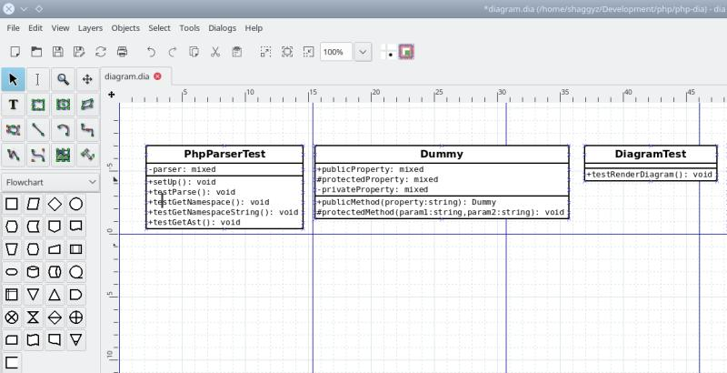

# PHP-Dia [](https://travis-ci.org/shaggyz/php-dia)

Simple PHP Application used to parse php source code files and generate GNU-Dia class diagram files.

## Requirements

+ php 7.1.x (It will run with 7.x in the future)

## Installation 

This installation is system-wide. 

```
    make
    sudo make install
```

You can remove phpdia from your system with ```sudo make uninstall```


## Testing

```make test```

## Usage: 

```
$ phpdia --help

Usage:
  phpdia [options] [--] <source>

Arguments:
  source                   The directory containing the PHP source code.

Options:
  -e, --exclude[=EXCLUDE]  Comma separated list of dir/files to exclude.
  -o, --output[=OUTPUT]    Output path for diagram file. [default: "./diagram.dia"]
  -c, --confirm            Confirm the file list before parse.
  -r, --raw                Disable file compression
  -d, --debug              Enable debug output.
  -h, --help               Display this help message
  -q, --quiet              Do not output any message
  -V, --version            Display this application version
      --ansi               Force ANSI output
      --no-ansi            Disable ANSI output
  -n, --no-interaction     Do not ask any interactive question
  -v|vv|vvv, --verbose     Increase the verbosity of messages: 1 for normal output, 2 for more verbose output and 3 for debug

Help:
  Creates GNU/Dia UML diagrams from PHP source code.

```

### Example

Generate a diagram from this application

```
$ phpdia src/

Parsing 47 files found in src/...

 47/47 -- [======================================================================]
 100% All files parsed.

Finished, file saved.

$ dia diagram.dia
```

Diagram file in GNU/Dia


